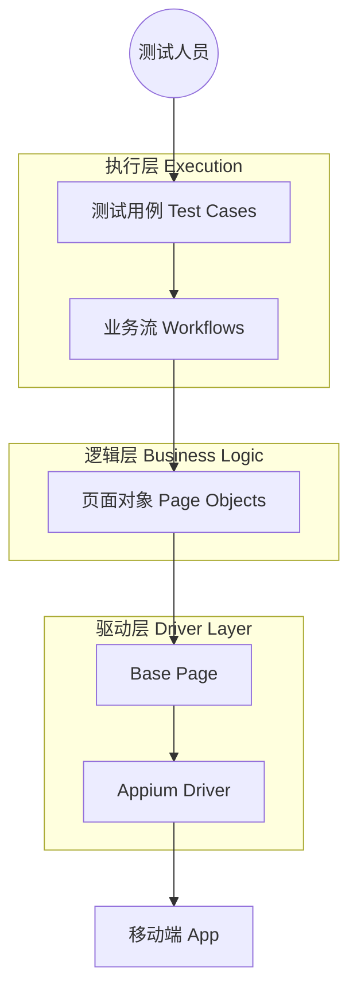

```markdown
[English](README.md) | [**中文文档**](README_CN.md)

# MobileAutomationFramework


**MobileAutomationFramework** 是一个企业级、高可扩展的移动端自动化测试框架（支持 Android/iOS）。

本项目基于 **Appium (Python Client 3.x)** 和 **Pytest** 构建，旨在解决 UI 自动化测试中常见的“运行不稳定”和“维护成本高”等痛点。通过严格执行 **三层架构设计 (Page-Workflow-Test)**，实现了测试逻辑与 UI 细节的完全解耦。

## 🏗️ 架构设计



## 🚀 核心特性

* ⚡ **零抖动策略 (Zero Flakiness)**: 内置智能显式等待和自动重试机制，彻底告别不稳定的 `time.sleep()`。
* 🧩 **模块化设计**: 将业务逻辑 (Workflows) 与 UI 元素 (Pages) 分离，UI 变动时只需修改 Page 层，无需改动用例。
* 📊 **可视化报告**: 测试失败时自动截图，并生成包含详细步骤和截图的 **Allure** 报告。
* 🔄 **W3C 标准**: 完全兼容 Appium 2.0+ 协议标准。
* 🚀 **懒加载机制**: 页面对象仅在被调用时初始化，大幅优化内存占用和启动速度。

## 📂 项目结构

```text
MobileAutomationFramework/
├── config/                 # [配置层] 静态配置 (环境地址, 日志设置)
├── drivers/                # [驱动层] Appium Driver 工厂类
├── pages/                  # [页面层] PO 页面对象 (UI 映射)
│   ├── android/            # Android 专用页面
│   └── base_page.py        # 页面交互基类 (封装 Find, Click 等)
├── reports/                # [报告层] Allure 报告 & 截图
├── testcases/              # [用例层] Pytest 测试脚本 (负责断言)
│   ├── conftest.py         # 核心 Fixtures & 钩子函数 (Hooks)
│   └── test_demo.py        # Demo 测试场景
├── utils/                  # [工具层] 通用助手 (ADB, Logger)
├── workflows/              # [流程层] 业务逻辑 (页面编排器)
├── pytest.ini              # Pytest 运行配置文件
└── requirements.txt        # 项目依赖库

```

## 🛠️ 快速开始

### 前置要求

* Python 3.9+
* Appium Server 2.x
* Android 模拟器或真机

### 1. 环境搭建

```bash
git clone [https://github.com/BOMBWCC/MobileAutomationFramework.git](https://github.com/BOMBWCC/MobileAutomationFramework.git)
cd MobileAutomationFramework

# 创建虚拟环境
python -m venv venv
# Windows:
venv\Scripts\activate
# Mac/Linux:
source venv/bin/activate

# 安装依赖
pip install -r requirements.txt

```

### 2. 项目配置

复制配置模板：

```bash
cp .env.example .env

```

编辑 `.env` 文件，填入你的设备信息：

```ini
PLATFORM_NAME=Android
DEVICE_NAME=emulator-5554
# 示例：安卓设置
APP_PACKAGE=com.android.settings
APP_ACTIVITY=.Settings

```

### 3. 运行测试

运行 Demo 测试（已配置自动生成 Allure 数据）：

```bash
pytest testcases/test_demo.py

```

### 4. 查看报告

```bash
allure serve ./reports/allure-results

```

## 📝 贡献

欢迎提交 Pull Request！如果是重大改动，请先提交 Issue 进行讨论。

## 📄 许可证

[MIT](https://choosealicense.com/licenses/mit/)

```

```
## 🤖 关于 Vibe Coding

本项目采用 **Vibe Coding** 模式构建。

* **设计理念**: Design as Constraint (设计即约束)。
* **构建方式**: 人类负责架构设计与骨架定义 (Specs/Skeletons)，AI 负责具体逻辑填充与实现。
* **核心文档**: 所有的设计契约均存储于 `.vscode/memory-bank/` 中，确保了代码实现严格遵循架构规范。