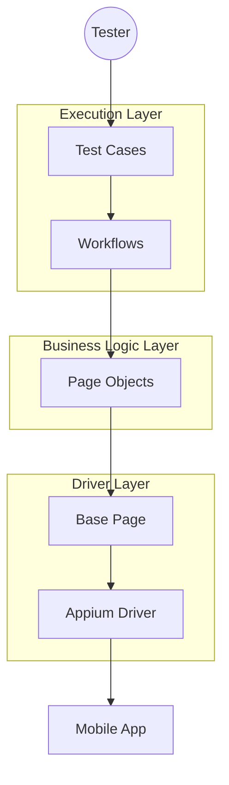

[**中文**](README_CN.md) | [English](README.md)

# MobileAutomationFramework


**MobileAutomationFramework** is an automated testing framework for Android and iOS. 

Built on **Appium (Python Client 3.x)** and **Pytest**, it solves the common pain points of UI automation—flakiness and maintainability—by enforcing a strict **3-Layer Architecture** (Page-Workflow-Test).

## 🏗️ Architecture



## 🚀 Key Features

* ⚡ **Zero Flakiness Strategy**: Built-in smart explicit waits and auto-retry mechanisms. No more `time.sleep()`.
* 🧩 **Modular Design**: Decouples business logic (Workflows) from UI details (Pages), making maintenance a breeze.
* 📊 **Visual Reporting**: Automatically captures screenshots on failure and integrates them into detailed **Allure** reports.
* 🔄 **W3C Compliance**: Fully compatible with modern Appium 2.0+ standards.
* 🚀 **Lazy Loading**: Page objects are initialized only when accessed, ensuring high performance.

## 📂 Project Structure

```text
MobileAutomationFramework/
├── config/                 # Configuration (Env, Logging)
├── drivers/                # Appium Driver Factory
├── pages/                  # Page Objects (UI Map)
│   ├── android/            # Android-specific Pages
│   └── base_page.py        # Base Interaction Logic
├── reports/                # Allure Reports & Screenshots
├── testcases/              # Pytest Tests (Assertions)
│   ├── conftest.py         # Fixtures & Hooks
│   └── test_demo.py        # Demo Scenarios
├── utils/                  # Helpers (ADB, Logger)
├── workflows/              # Business Logic (Page Orchestrator)
├── pytest.ini              # Pytest Config
└── requirements.txt        # Dependencies
```

## 🛠️ Quick Start

### Prerequisites

* Python 3.10+
* Appium Server 2.x
* Android Emulator/Device

### 1. Setup Environment

```bash
git clone [https://github.com/BOMBWCC/MobileAutomationFramework.git](https://github.com/BOMBWCC/MobileAutomationFramework.git)
cd MobileAutomationFramework

# Create Virtual Environment
python -m venv venv
# Windows:
venv\Scripts\activate
# Mac/Linux:
source venv/bin/activate

# Install Dependencies
pip install -r requirements.txt
```

### 2. Configure Project

Create your environment config:

```bash
cp .env.example .env
```

Edit `.env` with your device details:

```ini
PLATFORM_NAME=Android
DEVICE_NAME=emulator-5554
# Example: Android Settings
APP_PACKAGE=com.android.settings
APP_ACTIVITY=.Settings
```

### 3. Run Tests

Run the demo test with Allure reporting enabled:

```bash
pytest testcases/test_demo.py
```

### 4. View Report

```bash
allure serve ./reports/allure-results
```

## 📝 Contribution

Pull requests are welcome. For major changes, please open an issue first to discuss what you would like to change.

## 📄 License

[MIT](https://choosealicense.com/licenses/mit/)


## 🤖 About Vibe Coding

This project was built using the **Vibe Coding** methodology.

* **Philosophy**: **Design as Constraint**.
* **Workflow**: Humans define the architecture and code skeletons (Specs/Skeletons), while AI handles the logic implementation and details.
* **Compliance**: All design contracts are preserved in `.vscode/memory-bank/`, serving as the single source of truth to ensure AI strictly adheres to the architectural standards.